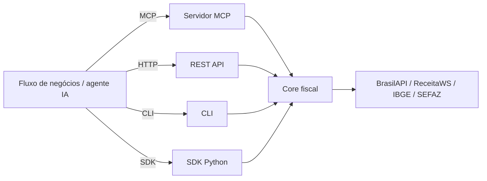

# MCP Fiscal Brasil

Hub fiscal brasileiro para automação com IA (CNPJ, NFe, SPED e regime tributário).

[](https://pypi.org/project/mcp-fiscal-brasil/)
[](https://www.python.org/)
[](https://modelcontextprotocol.io)
[](https://github.com/DeHor-Labs/mcp-fiscal-brasil/blob/main/LICENSE)

## O que é

`mcp-fiscal-brasil` conecta os dados fiscais brasileiros em quatro interfaces para **decisões repetíveis de operação**:



## Por que existe

O Brasil tem um ecossistema fiscal altamente fragmentado. Este projeto nasceu para reduzir o atrito de integrar esse contexto em assistentes de IA, rotinas de ERP e automações de operação fiscal.

## Módulo de posicionamento

Se você quer a visão completa de produto (o que resolve com segurança hoje e o que ainda é roadmap), comece por:

[:material-diagram-project: Posicionamento](positioning.md){ .md-button .md-button--primary }

## Ferramentas agenticas (núcleo operacional)

As ferramentas abaixo são as mais usadas em fluxos de produção:

- `analyze_cnpj_compliance` — relatório de compliance consolidado (CNPJ + Simples + MEI + CNAE)
- `risk_score_supplier` — due diligence com recomendação por política de risco
- [`consultar_empresas_lote`](use-cases/due-diligence.md) — triagem em lote de fornecedores com score e flags de risco
- `validate_nfe_full` — validação consolidada de XML/chave/situação do emissor
- `summarize_sped` — leitura executiva de SPED com inconsistências estruturais
- `compare_tax_regimes` — simulação MEI / Simples / Lucro Presumido / Lucro Real

## Workflows recorrentes

=== "Due diligence de fornecedor"

    - Entrada de fornecedor, contas a pagar, marketplace B2B
    - Resultado: status binário/quaternário + fatores de decisão
    - Tool: `risk_score_supplier`

=== "Validação de nota fiscal (entrada/recebimento)"

    - Ingestão de XML, validação de chave e situação do emissor
    - Resultado: parecer técnico com severidade e observações
    - Tool: `validate_nfe_full`

=== "Fechamento e consistência contábil"

    - SPED grande em lote, revisão rápida antes de homologação
    - Resultado: sumário estruturado por período, blocos, inconsistências
    - Tool: `summarize_sped`

=== "Planejamento tributário"

    - Roteiros comerciais e de pricing com cenários de faturamento
    - Resultado: ranking de regimes + economia estimada
    - Tool: `compare_tax_regimes`

!!! note "Observação de precisão"

    As ferramentas abaixo são executivas e **não substituem** parecer contábil.
    Elas não emitem certidões; para emissão manual, a entrega atual retorna URLs oficiais.

## Quick start

```bash
# Instalar
pipx install mcp-fiscal-brasil
# ou
uv tool install mcp-fiscal-brasil

# CLI
mcp-fiscal cnpj 12345678000190
mcp-fiscal compliance 12345678000190
mcp-fiscal regimes --faturamento 500000 --setor serviços --folha 180000

# REST API + Web UI demo
mcp-fiscal-api  # http://localhost:8000
```

```python
# SDK Python
import asyncio
from mcp_fiscal_brasil.agentic import analyze_cnpj_compliance

async def main():
    report = await analyze_cnpj_compliance("12345678000190")
    print(f"Risco: {report.risco_geral} (score {report.score}/100)")
    print(report.resumo_executivo)

asyncio.run(main())
```

## Onde ir agora

[:material-rocket: Comece pelo guia rápido](getting-started/quickstart.md){ .md-button .md-button--primary }
[:material-tools: Explore as tools agenticas](agentic/index.md){ .md-button }
[:material-file-document-outline: Casos de uso fiscais](use-cases/due-diligence.md){ .md-button }
[:material-github: Ver no GitHub](https://github.com/DeHor-Labs/mcp-fiscal-brasil){ .md-button }
